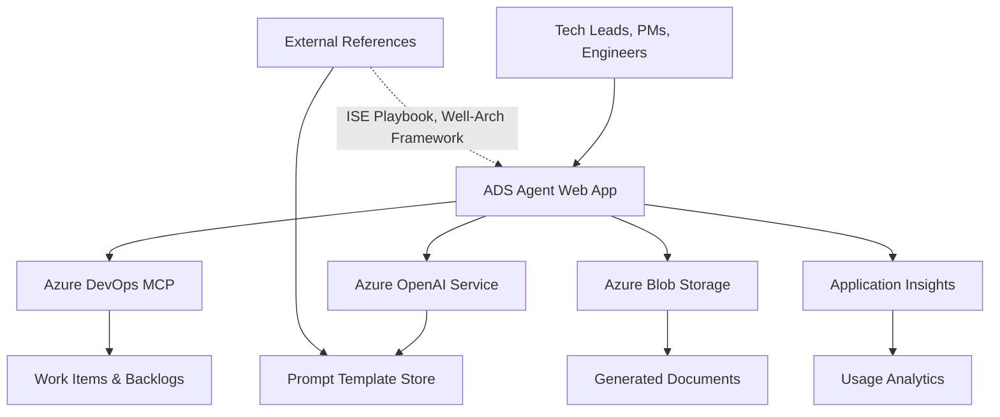

# Architecture Design Session Agent – Architecture Document

**Basics / Metadata**  

- Target release: August 15, 2025  
- Current status: Draft  
- Core team:  
  - Product Owner: Andrew Vineyard  
  - Engineering Lead: TBD  
  - AI/Prompt Engineer: TBD  
  - UX Designer: TBD  

---

## 1 Summary (≤ 200 words)

The Architecture Design Session Agent is an AI-powered platform that automates the generation of engineering artifacts (PRDs, architecture diagrams, backlogs) to reduce ADS turnaround time by 70%. Primary users include Tech Leads, Product Managers, and Software Engineers who need rapid, structured documentation aligned with Microsoft ISE Playbook and Azure Well-Architected Framework.

The system ingests high-level product concepts and generates complete "ADS Packets" including PRDs, Azure architecture diagrams, Azure DevOps backlogs, and verification plans. Critical quality attributes include accuracy (≥80% first-review approval), integration reliability with Azure DevOps MCP, and prompt engineering consistency.

The architecture leverages Azure's serverless and AI services for scalable document generation, with Azure OpenAI for content creation, Azure DevOps for backlog integration, and Azure Storage for artifact management. Security is paramount given the sensitive nature of architectural documentation, while performance targets sub-30-second generation times for typical PRDs.

## 2 Context Diagram

## 3 Logical Architecture

- **Web Application Layer** (Azure App Service) - Main user interface for input capture and artifact generation orchestration. Chosen for managed scaling and integrated security.
- **AI Generation Service** (Azure OpenAI) - Core content generation using GPT models with custom prompt engineering. Provides reliability through managed service with enterprise SLAs.
- **Prompt Management Service** (Azure Functions + Cosmos DB) - Stores and versions prompt templates. Function-based for cost optimization and Cosmos for global distribution.
- **DevOps Integration Service** (Azure Functions) - Handles Azure DevOps MCP integration for backlog injection. Serverless pattern for cost efficiency and reliability.
- **Document Storage Service** (Azure Blob Storage) - Stores generated artifacts with versioning. Provides cost-effective storage with security controls.
- **Analytics & Monitoring** (Application Insights + Log Analytics) - Tracks usage patterns and performance metrics for operational excellence.

## 4 Physical / Deployment View

- **Primary Region**: East US 2 (proximity to development teams)
- **Network**: VNet with private endpoints for PaaS services, Application Gateway with WAF
- **Compute**: App Service Premium v3 with autoscaling (2-10 instances)
- **Data Classification**:
  - Public: Generated templates, documentation examples
  - Internal: User-generated PRDs, architecture diagrams
  - Confidential: Prompt templates, usage analytics
- **Encryption**: TLS 1.3 in transit, AES-256 at rest via Azure-managed keys
- **Identity**: Azure AD integration with RBAC for different user personas

## 5 Cross-Cutting Concerns

| Pillar               | Design Tactics                                | Metrics / Alerts                |
|----------------------|----------------------------------------------|---------------------------------|
| Reliability          | Multi-zone App Service, OpenAI failover, retry patterns | 99.9% uptime, <30s P95 response |
| Security             | Private endpoints, managed identity, WAF      | Zero data breaches, compliance score >90% |
| Performance Efficiency | CDN for static assets, async processing     | <30s document generation, <2s UI load |
| Cost Optimization    | Serverless functions, blob lifecycle policies | <$500/month operational cost |
| Operational Excellence | ARM templates, CI/CD, comprehensive logging | <4hr MTTR, daily deployment capability |

## 6 Decision Log (ADRs)

- **ADR-001** Compute Platform — Azure App Service vs AKS
  - **Decision**: Azure App Service Premium v3
  - **Rationale**: Managed scaling, integrated security, faster time-to-market vs container orchestration complexity

- **ADR-002** AI Service — Azure OpenAI vs Custom Models
  - **Decision**: Azure OpenAI Service
  - **Rationale**: Enterprise SLA, built-in safety features, prompt engineering capabilities

- **ADR-003** Prompt Storage — File-based vs Database
  - **Decision**: Cosmos DB with versioning
  - **Rationale**: Global distribution, schema flexibility, version tracking for prompt evolution

- **ADR-004** DevOps Integration — Direct API vs MCP
  - **Decision**: Azure DevOps MCP integration
  - **Rationale**: Leverages existing organizational tooling, reduces maintenance overhead

## 7 Risks & Mitigations

| Risk | Impact | Likelihood | Mitigation | Owner |
|------|--------|------------|------------|-------|
| AI hallucinations in generated content | High | Medium | Human review workflows, content validation prompts | AI Engineer |
| Azure OpenAI quota limits | High | Low | Multi-region deployment, quota monitoring | Engineering Lead |
| DevOps MCP permission issues | Medium | Medium | Dedicated service principal, permission automation | DevOps Engineer |
| Prompt template quality degradation | Medium | Medium | A/B testing framework, quality metrics tracking | Product Owner |

## 8 Engineering Fundamentals Checklist

- ✅ Automated testing (unit, integration, E2E with Playwright)
- ✅ CI/CD pipeline with Azure DevOps
- ✅ Infrastructure as Code with ARM/Bicep templates
- ✅ Observability with Application Insights and custom dashboards
- ✅ Security scanning with Defender for Cloud
- ✅ Accessibility compliance (WCAG 2.1 AA)
- ✅ Performance testing with Azure Load Testing
- ✅ Disaster recovery with cross-region backup
- ✅ Documentation with automated API docs
- ✅ Code quality gates with SonarQube integration

## 9 Open Questions / Next Steps

### Immediate (Sprint 1-2)

- Finalize Azure DevOps MCP service principal permissions and scopes
- Validate OpenAI prompt engineering patterns for PRD generation
- Establish baseline performance metrics for 70% improvement target

### Short-term (Sprint 3-4)

- Define prompt template versioning and A/B testing strategy
- Implement GitHub Projects integration as DevOps alternative
- Create security model for custom prompt template management

### Long-term (Post-MVP)

- Evaluate Copilot plugin integration feasibility
- Design cross-team prompt sharing and governance model
- Plan E2E DevOps pipeline deployment capabilities (v2 scope)
